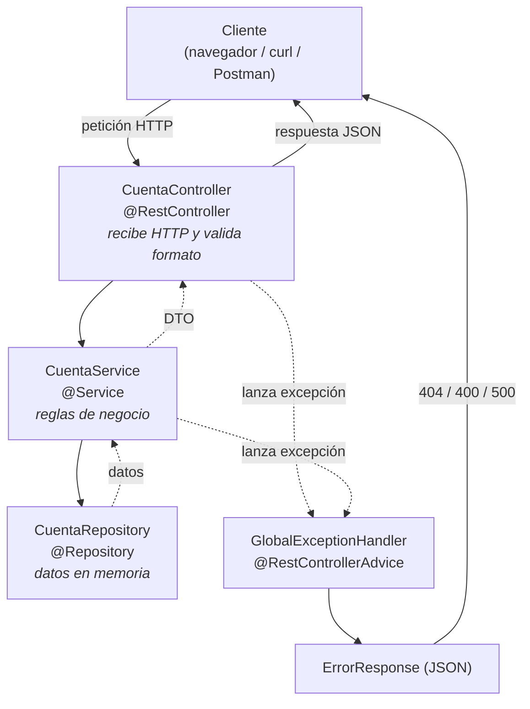

# Banco API — Semana 8

API REST construida con **Spring Boot** para consultar **saldos** y **movimientos**
de cuentas bancarias. Incluye validación de entrada, manejo centralizado de errores
y pruebas unitarias con cobertura del **98 %** (mínimo exigido: 80 %).

---

## Requisitos

| Herramienta | Versión usada | Nota |
|-------------|---------------|------|
| JDK         | **Java 25**   | Java moderno (LTS). |
| Maven       | **3.6.3**     | Spring Boot 3.5 exige Maven 3.6.3+. Con 3.6.1 los plugins fallan. |
| Spring Boot | 3.5.3         | Llega como dependencia; no se instala aparte. |

> Con SDKMAN: `sdk use maven 3.6.3` antes de compilar (la 3.6.1 no es compatible
> con los plugins de Spring Boot 3.5).

---

## Cómo ejecutar

```bash
# 1) Compilar, pasar pruebas y validar cobertura (>= 80%)
mvn clean verify

# 2) Levantar la aplicación (Tomcat embebido en el puerto 8080)
mvn spring-boot:run

# 3) Alternativa: construir el JAR y ejecutarlo
mvn clean package
java -jar target/banco-api-0.0.1-SNAPSHOT.jar
```

La aplicación queda escuchando en `http://localhost:8080`.

---

## Endpoints

| Método | Ruta                                      | Descripción                       |
|--------|-------------------------------------------|-----------------------------------|
| GET    | `/api/cuentas/{numeroCuenta}/saldo`       | Devuelve el saldo de la cuenta.   |
| GET    | `/api/cuentas/{numeroCuenta}/movimientos` | Devuelve los movimientos.         |

Cuentas de ejemplo precargadas en memoria: `12345`, `67890`, `11111`.

### Pruebas rápidas con `curl`

```bash
# Saldo (200 OK)
curl http://localhost:8080/api/cuentas/12345/saldo
# {"numeroCuenta":"12345","titular":"Renato Granados","saldo":1525.75,"moneda":"GTQ","estado":"ACTIVA"}

# Movimientos (200 OK)
curl http://localhost:8080/api/cuentas/12345/movimientos

# Cuenta inexistente (404 Not Found)
curl http://localhost:8080/api/cuentas/99999/saldo

# Formato inválido — no son dígitos (400 Bad Request)
curl http://localhost:8080/api/cuentas/abc/saldo
```

---

## Arquitectura en capas

La petición fluye de arriba hacia abajo; cada capa tiene una sola responsabilidad:



| Capa        | Clase                     | Responsabilidad                                  |
|-------------|---------------------------|--------------------------------------------------|
| Controller  | `CuentaController`        | Recibir la petición HTTP y validar el formato.   |
| Service     | `CuentaService`           | Reglas de negocio y armado de la respuesta (DTO).|
| Repository  | `CuentaRepository`        | Acceso a datos (simulado en memoria).            |
| Manejo error| `GlobalExceptionHandler`  | Convertir excepciones en respuestas HTTP claras. |
| DTOs        | `*Response`               | Definir el contrato JSON de la API.              |

### Más diagramas (carpeta [`docs/`](docs/))

Diagramas Mermaid adicionales, cada uno con su explicación para la práctica:

- [01 · Diagrama de clases](docs/01-diagrama-de-clases.md) — estructura y relaciones entre clases.
- [02 · Diagramas de secuencia](docs/02-diagrama-de-secuencia.md) — recorrido de una petición (200, 404 y 400).
- [03 · Inyección de dependencias](docs/03-inyeccion-de-dependencias.md) — qué beans administra Spring y cómo se conectan.
- [04 · Arranque de Spring Boot](docs/04-arranque-spring-boot.md) — qué pasa desde `main` hasta atender peticiones.

---

## Recorrido por el código

### 1. Modelo de dominio (`model/`)

Usamos `record` (Java moderno) porque son datos inmutables, y `BigDecimal` para
el dinero (nunca `double`, que arrastra errores de redondeo):

```java
public record Cuenta(String numero, String titular, BigDecimal saldo, EstadoCuenta estado) {}
```

### 2. Repositorio — acceso a datos (`repository/CuentaRepository.java`)

Marcado con `@Service`/`@Repository` para que Spring lo administre. Simula la base
de datos con un `Map` y una `List`. Devuelve `Optional` para no exponer `null`:

```java
@Repository
public class CuentaRepository {
    public Optional<Cuenta> buscarPorNumero(String numeroCuenta) {
        return Optional.ofNullable(cuentas.get(numeroCuenta));
    }

    public List<Movimiento> buscarMovimientos(String numeroCuenta) {
        return movimientos.stream()
                .filter(m -> m.numeroCuenta().equals(numeroCuenta))
                .sorted((a, b) -> b.fecha().compareTo(a.fecha())) // más reciente primero
                .collect(Collectors.toList());
    }
}
```

### 3. Servicio — lógica de negocio (`service/CuentaService.java`)

Recibe el repositorio **por constructor** (inyección de dependencias). No sabe nada
de HTTP. Valida, busca y arma el DTO. Si la cuenta no existe, lanza una excepción:

```java
@Service
public class CuentaService {
    private final CuentaRepository cuentaRepository;

    public CuentaService(CuentaRepository cuentaRepository) {   // DI por constructor
        this.cuentaRepository = cuentaRepository;
    }

    public SaldoResponse consultarSaldo(String numeroCuenta) {
        Cuenta cuenta = obtenerCuenta(numeroCuenta);
        return new SaldoResponse(cuenta.numero(), cuenta.titular(),
                                 cuenta.saldo(), "GTQ", cuenta.estado());
    }

    private Cuenta obtenerCuenta(String numeroCuenta) {
        if (numeroCuenta == null || numeroCuenta.isBlank()) {
            throw new CuentaInvalidaException("El numero de cuenta es obligatorio");
        }
        return cuentaRepository.buscarPorNumero(numeroCuenta)
                .orElseThrow(() -> new CuentaNoEncontradaException(numeroCuenta));
    }
}
```

### 4. Controlador — capa HTTP (`controller/CuentaController.java`)

Expone las rutas y **valida el formato** del número con `@Pattern` (entre 4 y 10
dígitos). En Spring Boot 3.5 la validación de parámetros es nativa: si no cumple,
se lanza `HandlerMethodValidationException` antes de entrar al método.

```java
@RestController
@RequestMapping("/api/cuentas")
public class CuentaController {
    private final CuentaService cuentaService;

    public CuentaController(CuentaService cuentaService) {
        this.cuentaService = cuentaService;
    }

    @GetMapping("/{numeroCuenta}/saldo")
    public SaldoResponse consultarSaldo(
            @PathVariable
            @Pattern(regexp = "\\d{4,10}",
                     message = "El numero de cuenta debe tener entre 4 y 10 digitos")
            String numeroCuenta) {
        return cuentaService.consultarSaldo(numeroCuenta);
    }
}
```

### 5. Manejo centralizado de errores (`exception/GlobalExceptionHandler.java`)

`@RestControllerAdvice` intercepta las excepciones de **cualquier** controlador y
las traduce a un JSON de error uniforme. Así los controladores quedan limpios:

```java
@RestControllerAdvice
public class GlobalExceptionHandler {

    @ExceptionHandler(CuentaNoEncontradaException.class)
    public ResponseEntity<ErrorResponse> manejarCuentaNoEncontrada(...) {
        return construir(HttpStatus.NOT_FOUND, ex.getMessage(), request, null);   // 404
    }

    @ExceptionHandler(HandlerMethodValidationException.class)
    public ResponseEntity<ErrorResponse> manejarValidacion(...) {
        return construir(HttpStatus.BAD_REQUEST, "Uno o mas parametros no son validos",
                         request, detalles);                                       // 400
    }
}
```

Ejemplo de respuesta de error (cuenta inexistente):

```json
{
  "timestamp": "2026-06-27T14:11:12.17",
  "status": 404,
  "error": "Not Found",
  "mensaje": "No existe la cuenta con numero: 99999",
  "ruta": "/api/cuentas/99999/saldo",
  "detalles": null
}
```

---

## Pruebas y cobertura

16 pruebas en tres niveles. Cada una aísla la capa que prueba:

| Archivo                      | Qué prueba                          | Técnica                         |
|------------------------------|-------------------------------------|---------------------------------|
| `CuentaServiceTest`          | Lógica de negocio y excepciones     | Mockito (`@Mock` del repositorio)|
| `CuentaControllerTest`       | Rutas, códigos HTTP y JSON          | `@WebMvcTest` + `MockMvc`       |
| `CuentaRepositoryTest`       | Datos semilla, filtrado y orden     | Instancia directa               |

En el test del servicio se simula el repositorio para probar solo la lógica:

```java
@ExtendWith(MockitoExtension.class)
class CuentaServiceTest {
    @Mock private CuentaRepository cuentaRepository;
    @InjectMocks private CuentaService cuentaService;

    @Test
    void consultarSaldo_lanzaExcepcionCuandoLaCuentaNoExiste() {
        when(cuentaRepository.buscarPorNumero("99999")).thenReturn(Optional.empty());
        assertThatThrownBy(() -> cuentaService.consultarSaldo("99999"))
                .isInstanceOf(CuentaNoEncontradaException.class);
    }
}
```

La cobertura la mide **JaCoCo**, configurado en el `pom.xml` para **fallar el build
si baja del 80 %** (la clase `main` se excluye porque solo arranca Spring):

```bash
mvn clean verify
# Reporte HTML navegable:
#   target/site/jacoco/index.html
```

Resultado actual: **98 % de instrucciones cubiertas**.

---

## Estructura del proyecto

```
banco-api/
├── pom.xml
├── README.md
└── src/
    ├── main/
    │   ├── java/edu/curso/bancoapi/
    │   │   ├── BancoApiApplication.java      # arranque de Spring Boot
    │   │   ├── controller/CuentaController.java
    │   │   ├── service/CuentaService.java
    │   │   ├── repository/CuentaRepository.java
    │   │   ├── model/      (Cuenta, Movimiento, enums)
    │   │   ├── dto/        (SaldoResponse, MovimientosResponse, ErrorResponse, ...)
    │   │   └── exception/  (excepciones + GlobalExceptionHandler)
    │   └── resources/application.properties
    └── test/java/edu/curso/bancoapi/
        ├── controller/CuentaControllerTest.java
        ├── service/CuentaServiceTest.java
        └── repository/CuentaRepositoryTest.java
```

---

## Decisiones de diseño

- **DTOs en vez de exponer el modelo:** la API controla qué datos publica y puede
  cambiar el dominio interno sin romper el contrato JSON.
- **`BigDecimal` para dinero:** evita errores de redondeo del punto flotante.
- **Errores centralizados:** un único formato de error para todo el sistema.
- **Inyección por constructor:** facilita las pruebas (se inyectan mocks) y deja las
  dependencias explícitas e inmutables (`final`).
```
